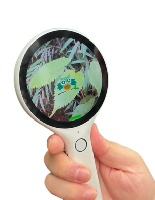

# 智能硬件产品/AIGC应用 - AI儿童认知学习放大镜

> 本项目结合智能硬件与AI识别技术，设计一款帮助儿童认识自然、学习知识的互动产品。通过摄像头、AI模型和交互界面，实现物品识别、知识讲解及游戏互动，提升儿童的认知能力与学习趣味性。

### 产品解决的问题

通过设计符合儿童使用习惯的UI界面和交互方式，并使用AIGC技术和图像识别技术提升学龄期儿童的对知识的探索欲

- 儿童认知启蒙难题：针对3-8岁儿童，很多孩子缺乏系统性、趣味化的方式去认识世界中的动植物、物品。
- 学习记忆效果差：单向讲解容易让孩子遗忘，缺乏互动与记忆强化环节。
- 学习趣味性不足：传统认知教育内容单调，无法满足孩子好奇心，缺乏吸引力。

### 产品主要功能

1. 实时识别讲解：AI识别物品并提供生动有趣的语音讲解。
2. 互动记忆强化：通过同类辨识游戏帮助孩子加深认知。
3. 学习回顾与串联：AI记录当日学习内容，并通过故事模式在睡前回顾，提升记忆效果。

### 技术方案

#### 软件部分

- 图像识别：使用YOLO等目标检测模型实现物品图像识别。

- 大语言模型生成对话：调用大语言模型API或使用ollma本地部署模型，将识别数据上传至模型，生成讲解内容

- 语音合成：采用百度语音合成模型API或本地部署ChatTTS模型，将讲解内容转化为语音。

- 互动游戏模块：

  - 同类辨识游戏：在屏幕上展示多个相似物品，引导孩子识别正确答案。

  - 错误反馈与讲解：若选择错误，系统自动讲解正确答案与错误物品的区别。

- 学习记录与回顾：
  - AI自动记录孩子识别的物品和学习进度。
  - 睡前生成一个串联物品的故事，通过趣味叙述加深孩子印象。

#### 硬件部分（选做）

- 摄像头：负责捕捉图像，确保清晰度和实时性。
- 触摸显示屏：提供物品图像及互动操作界面，让孩子通过触摸屏幕参与互动游戏。
- 扬声器：实现语音讲解和反馈，适合儿童接受。
- 麦克风：接受来自儿童的语音

#### 系统架构

- 硬件采集：摄像头捕捉图像并传入系统。
- 数据传输：本地与AI服务器进行通信。
- AI处理：图像识别并调用大语言模型匹配相关知识内容。
- 用户界面：显示结果，提供互动反馈和游戏体验。

### 设计参考

### 可用性测试

#### 目标用户

邀请3名同学或儿童进行测试，观察他们的使用体验。

#### 测试内容

##### 设备识别准确率：

记录AI对不同物品的识别准确率。

##### 用户操作体验：

- 观察孩子是否能够自主使用，界面操作是否顺畅，交互逻辑是否符合儿童使用习惯

- AI讲解的内容和方式是否贴合儿童的语言认知习惯。

##### 学习效果反馈：
测试孩子是否记住讲解的知识点。

##### 游戏互动性：

测试同类辨识游戏是否有趣且易于理解。

