# 奇趣探索镜-儿童认知大自然APP


> 本项目结合智能硬件与AI识别技术，旨在设计一款互动性强、富有趣味的产品，帮助儿童认识自然并学习相关知识。通过集成麦克风、摄像头、大语言模型和视觉检测模型，搭建一个适合儿童的交互界面，产品能够实现动植物识别与知识讲解等功能。通过这种创新的互动方式，不仅提升儿童的认知能力，还能激发他们对自然世界的兴趣，增强学习的趣味性与探索精神。

### 1.项目文件结构

TODO

### 2.项目背景

**认知教育行业现状**：当前，认知教育在家庭和学校教育中面临多个挑战。家庭教育存在系统性不足的问题，家长的教育资源有限，难以为孩子提供丰富且多样化的认知学习场景。学校教育方面，由于资源局限，课堂上的知识传递方式单一，难以满足孩子多元化的认知需求。而传统教育手段滞后，主要依赖平面书本，缺乏动态互动的形式，无法有效激发孩子的学习兴趣与认知能力。

**项目目标人群**：正在上幼儿园或者小学的儿童（4-12岁）

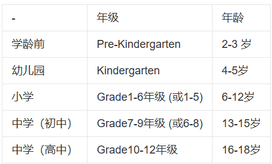

- 人群特点：语言学习能⼒强、好奇心旺盛、喜欢视觉和互动式体验。 
- 人群需求：向往游戏化、趣味化的学习方式，激发主动探索的兴趣。

### 3.功能描述

该App一共包含如下三个功能模块

- **放大镜探索自然模块**

  在该模块中，小朋友可以使用摄像头拍摄识别⾝边的物品（花卉、动物、蔬果......），软件会自动生成小朋友能听的懂、学得会的AI语音讲解。

- **土拨鼠百科模块**

  在该模块下，小朋友可以通过麦克风向软件中虚拟的土拨老师问问题，软件会自动生成小朋友能听的懂、学得会的AI语音讲解，并展示相关的图片和文字内容

- **复习冒险模块**

  在该模块下，软件会自动整合小朋友的最近一段时间的学习记录，AI生成有趣的冒险故事，⽆痛帮助小朋友复习，强化记忆。

### 4.技术栈

#### 软件架构图

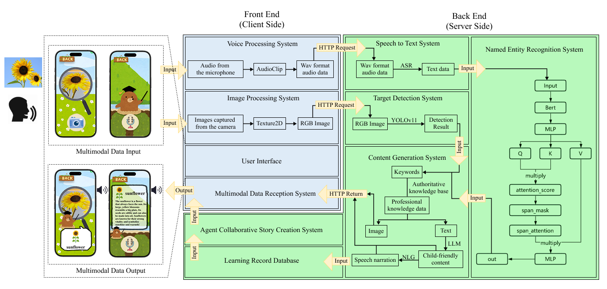

#### YOLOV11模型训练

为了APP能够实现动植物识别的功能，我们使用了优秀的视觉检测模型YOLOV11s作为底层模型，自建动植物图像数据集训练出专门识别动植物的模型。

自建动植物数据集目前有10个label，分别是：

```
0: sunflower
1: tulip
2: rose
3: cat
4: sheep
5: butterfly
6: elephant
7: dog
8: daisy
9: dandelion
```

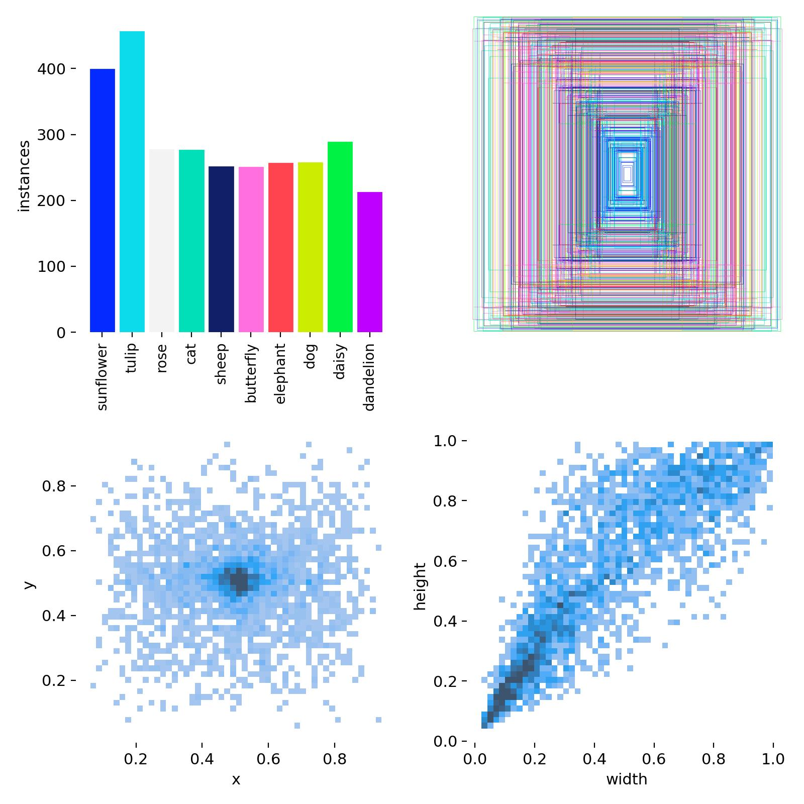

YOLO格式的数据集目录结构如下

```
dataset/
├── images/
│   ├── train
│   	├── image1.jpg
│   	├── image2.png
│   	├── ...
│   	├── imageN.jpeg
│   ├── val
│   	├── image1.jpg
│   	├── image2.png
│   	├── ...
│   	├── imageN.jpeg
├── labels/
│   ├── train
│   	├── image1.txt
│   	├── image2.txt
│   	├── ...
│   	├── imageN.txt	
│   ├── val
│   	├── image1.txt
│   	├── image2.txt
│   	├── ...
│   	├── imageN.txt
└── data.yaml   (或类似的配置文件，用于指定数据集信息)
```

对于每个标签，使用LabelImage分别标记注了超200张相关图片用于模型训练，50张图片用于模型置信度验证

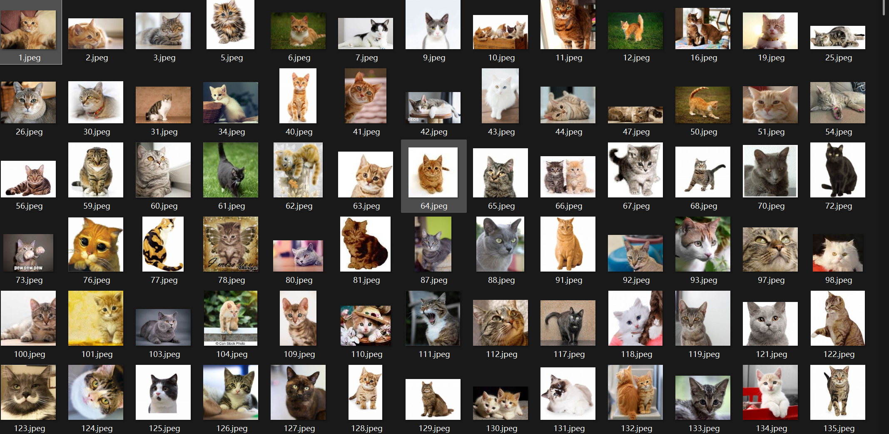

YOLO格式的标记数据

```
3 0.295000 0.355556 0.456667 0.622222
3 0.723333 0.493333 0.486667 0.648889
```

训练代码示例如下：

```
from ultralytics import YOLO

# Load a model
model = YOLO("yolo11s.pt")  # load a pretrained model (recommended for training)
data_set="my_dataset/data.yaml"
if __name__ == '__main__':
    # Train the model
    results = model.train(data=data_set,  epochs=100, imgsz=416,  rect = True, project='models', name='last_model', workers = 0)
```

训练的模型的结果如下：

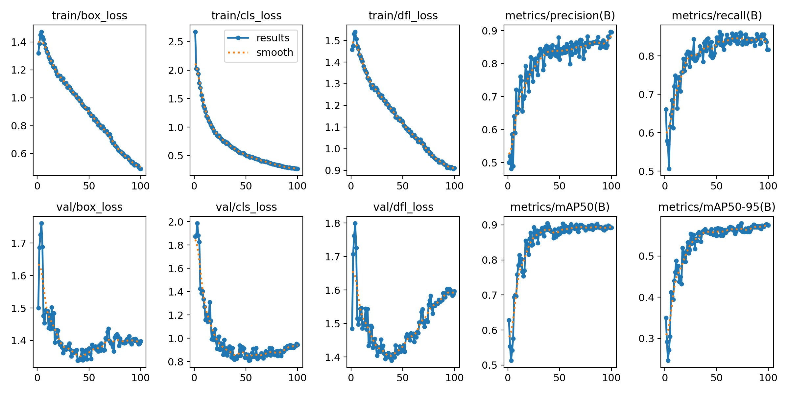

训练截图

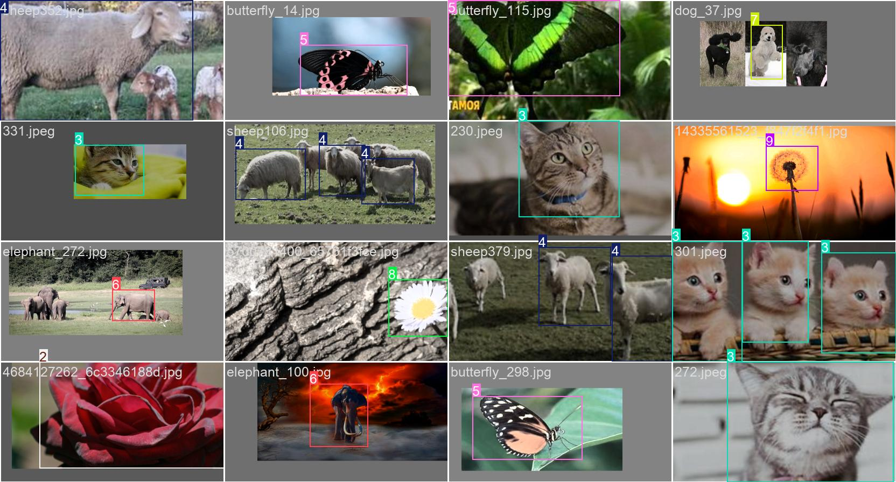

验证批次截图

标记位置

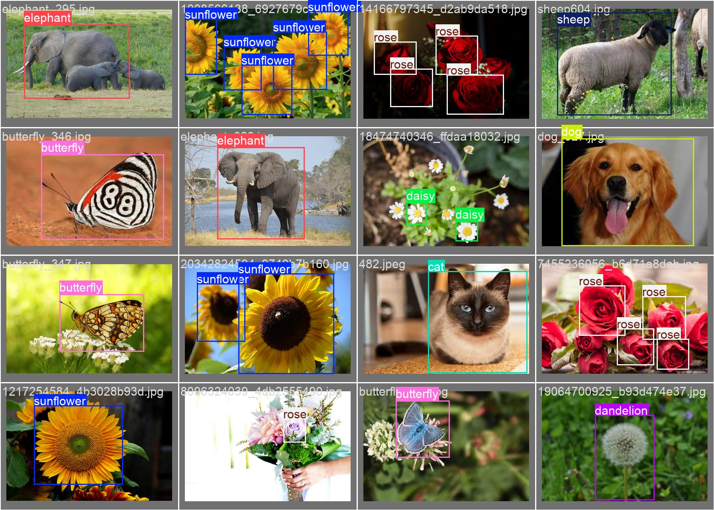

预测位置

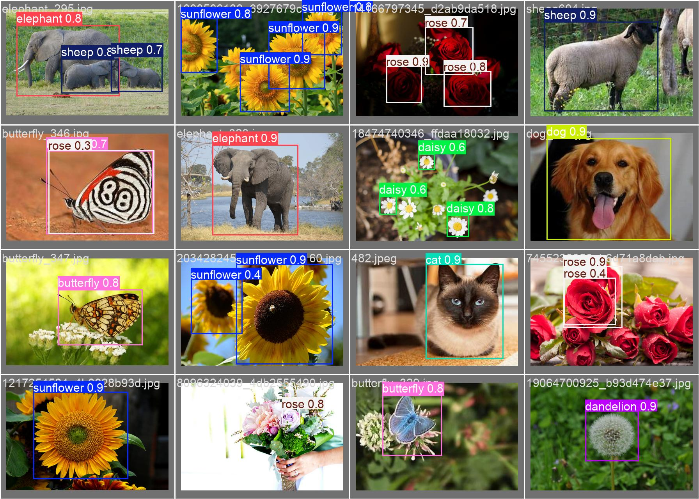

可以看出预测结果相对较好，相较于基座模型，我自训练的模型可以更精准识别动植物的种类，并且能够识别更多的动植物

基座模型识别结果：

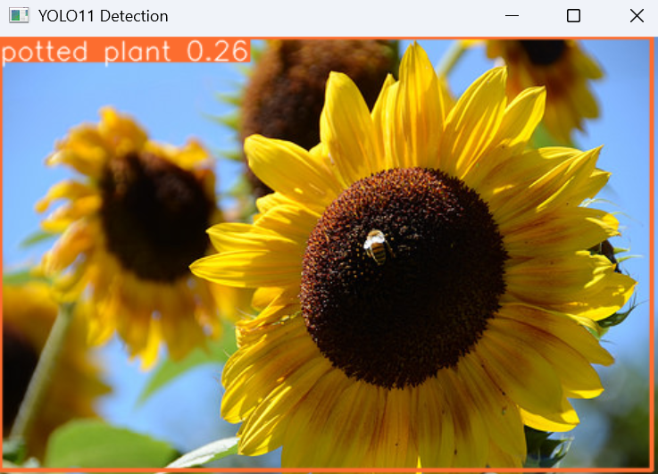

自训练模型识别结果：

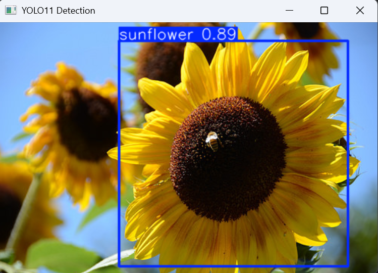

使用YOLOV11模型检测物体的例程如下

```
import cv2
from ultralytics import YOLO

# 加载模型
model = YOLO("yolo11s.pt")

# 读取图像
im2 = cv2.imread("test-img/sunflower.jpg")

# 进行预测
results = model.predict(source=im2)

# 获取预测后的图像结果
annotated_frame = results[0].plot()

# 使用OpenCV显示结果
cv2.imshow("YOLO11 Detection", annotated_frame)
cv2.waitKey(0)  # 等待按键关闭窗口
cv2.destroyAllWindows()
```

完整的训练代码、数据集以及预训练模型可以查看<链接>

#### 前端APP

在前端开发过程中，我选择了自己熟悉的开发平台——**Unity**。得益于在课程中学习的 **Figma Converter for Unity** 插件，能够高效地将设计师在Figma中绘制的UI资产自动化导入Unity，从而大幅节省了开发时间和精力。（在此特别鸣谢AKi老师，她精心设计的UI界面帮助我们实现了功能与美学的完美结合。）

**Figma Converter for Unity** 插件（[Figma Converter for Unity](https://assetstore.unity.com/packages/tools/utilities/figma-converter-for-unity-198134)）能够自动将Figma中的布局（Layout）直接转换为Unity中的画布（Canvas）。只需简单的操作，插件便能完成整个导入过程，无需手动调整。（插个广告）

前端界面主要包括四个场景：

**主页**

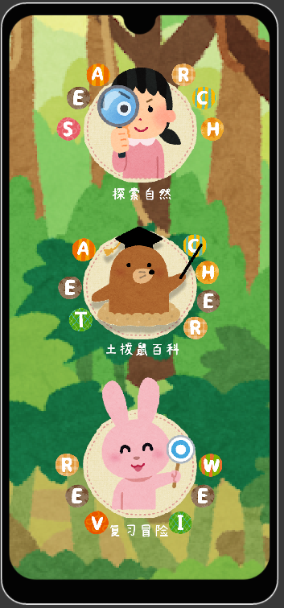

**放大镜探索自然场景**

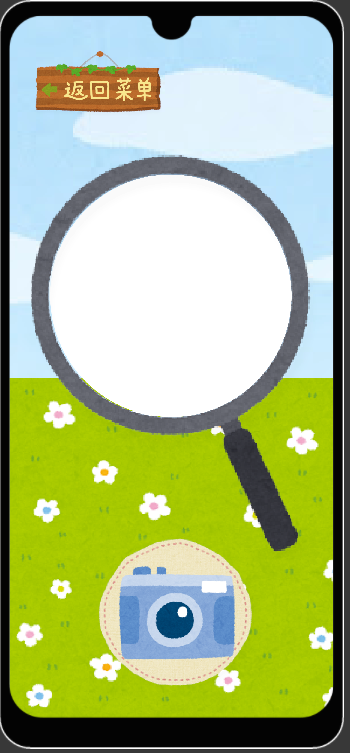

**土拨鼠百科场景**

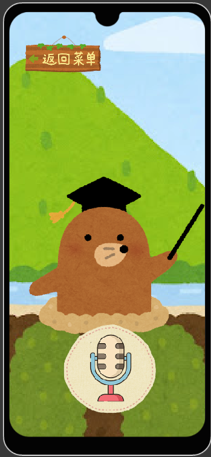

**复习回顾探险场景**

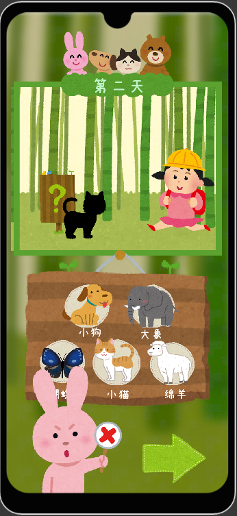

#### 后端服务器

- 使用编程语言：Python
- 使用的框架和库：Flask、YOLO、opencv-python、websocket等，具体详见requirements.txt
- API：DeepSeeek-v3、[Baidu-AIP](https://github.com/Baidu-AIP)、讯飞短语音识别API等

**后端服务器的主要工作**

1. **放大镜探索自然模块**：该模块接收前端应用传输的图片数据，并通过视觉识别模型进行图像分析。识别结果经过提示词工程处理后，发送至大语言模型API，生成针对儿童的科普讲解文本。随后，文本数据被传输至文本转语音（TTS）模型API，转化为人类语音输出。最后，系统将查询历史数据及生成的语音数据返回至前端应用。
2. **土拨鼠百科模块**：该模块接收前端应用传输的语音数据，并通过语音识别API将其转换为文本。文本数据随后通过命名实体识别模型提取关键字，基于提取的关键字在本地数据库中匹配相关科普内容。匹配到的文本内容再通过TTS语言模型API转化为人类语音，并将查询历史、匹配的文本内容和生成的语音数据返回至前端应用。
3. 复习冒险模块：TODO

**后端服务器实现细节**

1. 调用本地运行的YOLO视觉模型的代码如下

```
def YOLO_detect(img):
    # 进行预测
    results = model.predict(source=img)
    detected_objects = []

    # 提取检测结果
    for result in results:
        boxes = result.boxes.xyxy  # 边界框坐标
        scores = result.boxes.conf  # 置信度分数
        classes = result.boxes.cls  # 类别索引

        # 如果有类别名称，可以通过类别索引获取
        class_names = [model.names[int(cls)] for cls in classes]

        for box, score, class_name in zip(boxes, scores, class_names):
            # print(f"Class: {class_name}, Score: {score:.2f}, Box: {box}")
            if score > 0.7 and class_name not in detected_objects:
                detected_objects.append(class_name)
    if detected_objects:
        return detected_objects
    else:
        return None
```

2. 调用大语言模型API

使用大语言模型生成面向儿童的科普讲解文本具有以下优势：对于相同的检测对象，每次生成的讲解文本都会有所变化，而不是每次都使用预设的固定文字。这样生成的文本更具自然性和多样性，避免了机械化的回答，使内容更加富有生动性和趣味性，更易于吸引儿童的注意力并提升其学习兴趣。

调用的谷歌的Gemini1.5pro的API的例程如下

```
import google.generativeai as genai

genai.configure(api_key="Yours")
genai_model = genai.GenerativeModel("gemini-1.5-pro")

def gemini(text):
    response = genai_model.generate_content(text)
    return response.text

text = '你是一个小学老师，请用少于100个字向上小学的小朋友科普玫瑰花,用："小朋友你好，这是玫瑰花"开头'
respond = gemini(text)
print(respond)
```

通过设计恰当的提示词，可以使大模型的回答更加可控和有用

第一版提示词

```
text = '你是一个小学老师，请向上小学的小朋友科普玫瑰花,用："小朋友你好，这是玫瑰花"开头'
```

第二版提示词

```
text = "你是一个小学老师，使用少于100个字向上小学的小朋友科普" + str(detection) + "(请在回答时用中文代替),用：小朋友你好，这是" + str(detection) + "(请在回答时用中文代替)开头。"
```

3. 调用百度TTS文生语音模型API

由于我们的软件主要面向4至12岁的学龄前和学龄儿童，这一年龄段的孩子们可能还未掌握较多的汉字。因此，采用语言交互方式能够让孩子们在学习大自然知识时更加轻松和高效。相比于依赖文字输入或阅读，语言互动降低了认知和语言表达的难度，使得孩子们能够更加自然地参与到学习过程中，促进其理解和记忆。

TTS文生语音模型API的例程如下

```
from aip import AipSpeech
import os

APP_ID = 'Yours'
API_KEY = "Yours"
SECRET_KEY = "Yours"


def baidu_tts(text):
    client = AipSpeech(APP_ID, API_KEY, SECRET_KEY)
    voice = client.synthesis(text, 'zh', 6, {'spd': 5,'pit':5, 'vol': 15, 'per': 4100, 'aue':6})
    with open("next.wav", 'wb') as fp:
        fp.write(voice)


text = "答对了，快继续探险吧！"
baidu_tts(text)
# os.system("SearchTutorial.wav")
```

4. 调用ASR语音识别Api

   TODO

### 4.使用演示视频

[基于NER和YOLOv11的儿童早教机器人应用Adventure-Magnifier显示Demo_哔哩哔哩_bilibili](https://www.bilibili.com/video/BV1V3dVYuEaU/?spm_id_from=333.1387.homepage.video_card.click&vd_source=bf08880c4c4d8fdcca4d17ed2ee821fe)

### 5.鸣谢

本软件前端UI界面素材来自：https://www.irasutoya.com/，十分感谢！

