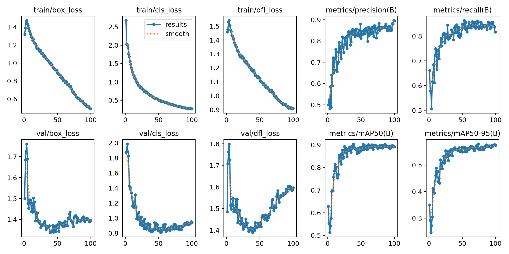
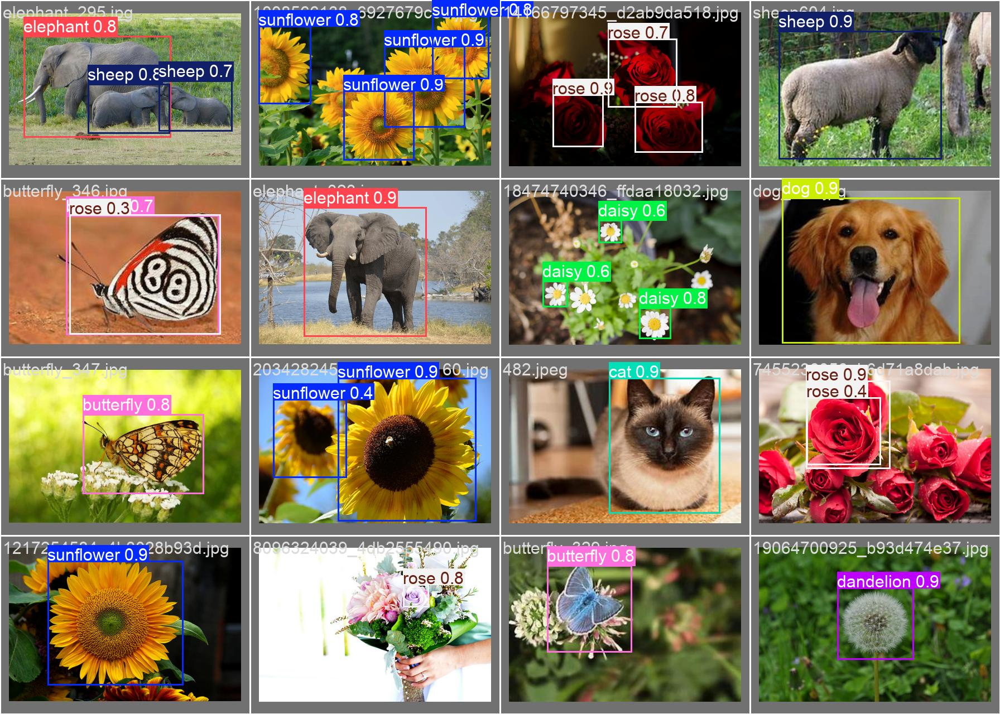

# 奇趣探索镜-AI儿童认知学习应用

> 本项目是作者在《交互技术》课程上的大作业，该项目使用YOLOV11视觉识别模型和Gemini1.5pro大语音模型API以及百度语音TTSAPI，开发一款帮助儿童认识自然、学习自然知识的AI互动APP。通过摄像头、AI模型和交互界面，实现动植物识别、知识讲解及游戏互动，旨在提升儿童的认知能力与学习趣味性。

### 1.项目文件结构

### 2.YOLOV11模型训练

为了APP能够实现动植物识别的功能，我使用了目前最先进的视觉检测模型YOLOV11s作为底层模型，自建动植物图像数据集训练出专门识别动植物的模型。

自建动植物数据集目前有10个label，分别是：

```
0: sunflower
1: tulip
2: rose
3: cat
4: sheep
5: butterfly
6: elephant
7: dog
8: daisy
9: dandelion
```


YOLO格式的数据集目录结构如下

```
dataset/
├── images/
│   ├── train
│   	├── image1.jpg
│   	├── image2.png
│   	├── ...
│   	├── imageN.jpeg
│   ├── val
│   	├── image1.jpg
│   	├── image2.png
│   	├── ...
│   	├── imageN.jpeg
├── labels/
│   ├── train
│   	├── image1.txt
│   	├── image2.txt
│   	├── ...
│   	├── imageN.txt	
│   ├── val
│   	├── image1.txt
│   	├── image2.txt
│   	├── ...
│   	├── imageN.txt
└── data.yaml   (或类似的配置文件，用于指定数据集信息)
```

对于每个标签，我使用LabelImage分别标记注了超200张相关图片用于模型训练，50张图片用于模型置信度验证


YOLO格式的标记数据

```
3 0.295000 0.355556 0.456667 0.622222
3 0.723333 0.493333 0.486667 0.648889
```

训练代码示例如下：

```
from ultralytics import YOLO

# Load a model
model = YOLO("yolo11s.pt")  # load a pretrained model (recommended for training)
data_set="my_dataset/data.yaml"
if __name__ == '__main__':
    # Train the model
    results = model.train(data=data_set,  epochs=100, imgsz=416,  rect = True, project='models', name='last_model', workers = 0)
```

训练的模型的结果如下：



训练截图


验证批次截图

标记位置


预测位置



可以看出预测结果相对较好

相较于基座模型，我自训练的模型可以更精准识别动植物的种类，并且能够识别更多的动植物

基座模型：


自训练模型：


使用YOLOV11模型检测物体的例程如下

```
import cv2
from ultralytics import YOLO

# 加载模型
model = YOLO("yolo11s.pt")

# 读取图像
im2 = cv2.imread("test-img/sunflower.jpg")

# 进行预测
results = model.predict(source=im2)

# 获取预测后的图像结果
annotated_frame = results[0].plot()

# 使用OpenCV显示结果
cv2.imshow("YOLO11 Detection", annotated_frame)
cv2.waitKey(0)  # 等待按键关闭窗口
cv2.destroyAllWindows()
```

### 2.服务器后端开发说明

服务器后端的主要功能是接收APP前端传输的图片，调用视觉模型进行识别，将识别结果经过提示词工程处理后发送给大语言模型生成

面向儿童的科普讲解文本，然后再将文本传输传给TTS语言模型生成人类语音，最后将检测历史和语音发送回APP前端。后端的编写语言是Python。

#### 2.1调用本地运行的视觉模型

之前已经提到使用的视觉模型是基于YOLOV11s再训练的动植物检测模型，因此不再赘述。

调用模型的代码如下

```
def YOLO_detect(img):
    # 进行预测
    results = model.predict(source=img)
    detected_objects = []

    # 提取检测结果
    for result in results:
        boxes = result.boxes.xyxy  # 边界框坐标
        scores = result.boxes.conf  # 置信度分数
        classes = result.boxes.cls  # 类别索引

        # 如果有类别名称，可以通过类别索引获取
        class_names = [model.names[int(cls)] for cls in classes]

        for box, score, class_name in zip(boxes, scores, class_names):
            # print(f"Class: {class_name}, Score: {score:.2f}, Box: {box}")
            if score > 0.7 and class_name not in detected_objects:
                detected_objects.append(class_name)
    if detected_objects:
        return detected_objects
    else:
        return None
```

#### 2.2调用大语言模型API

使用大语言模型来生成面向儿童的科普讲解文本的优势有：1.对于相同的检测对象，每次检测后生成的文本会变动，相较于预设文字回答更加自然。

我选择调用的大模型I是谷歌的Gemini1.5pro，调用API的例程如下

```
import google.generativeai as genai

genai.configure(api_key="Yours")
genai_model = genai.GenerativeModel("gemini-1.5-pro")

def gemini(text):
    response = genai_model.generate_content(text)
    return response.text

text = '你是一个小学老师，请用少于100个字向上小学的小朋友科普玫瑰花,用："小朋友你好，这是玫瑰花"开头'
respond = gemini(text)
print(respond)
```

通过设计恰当的提示词，可以使大模型的回答更加可控和有用

第一版提示词

```
text = '你是一个小学老师，请向上小学的小朋友科普玫瑰花,用："小朋友你好，这是玫瑰花"开头'
```

第二版提示词

```
text = "你是一个小学老师，使用少于100个字向上小学的小朋友科普" + str(detection) + "(请在回答时用中文代替),用：小朋友你好，这是" + str(detection) + "(请在回答时用中文代替)开头。"
```

#### 2.3调用百度TTS文生语音模型API

因为我们的应用面向的用户群体是：4~8岁的学龄前和学龄儿童，这个小朋友们可能认识的汉字还不是更多，因此使用语言交互可以让小朋友更轻松更高效地了解学习有关大自然的知识。

TTS文生语音模型API的例程如下

```
from aip import AipSpeech
import os

APP_ID = 'Yours'
API_KEY = "Yours"
SECRET_KEY = "Yours"


def baidu_tts(text):
    client = AipSpeech(APP_ID, API_KEY, SECRET_KEY)
    voice = client.synthesis(text, 'zh', 6, {'spd': 5,'pit':5, 'vol': 15, 'per': 4100, 'aue':6})
    with open("next.wav", 'wb') as fp:
        fp.write(voice)


text = "答对了，快继续探险吧！"
baidu_tts(text)
# os.system("SearchTutorial.wav")
```

#### 2.4Python后端和Unity前端的信息通讯

在开发前端时我使用的开发平台是自己比较熟悉的Unity，因此我需要解决Python后端和Unity前端的信息通讯问题

具体的实现思路是：将相机捕捉传到Unity的图片通过TCP协议发送给python服务器端，将生成的科普讲解语音通过TCP协议传回Unity，具体实现细节请看代码文件

### 2.Unity前端开发说明

在开发前端时我使用的开发平台是自己比较熟悉的Unity，并且由于使用之前在课程上学习的Figma Converter for Unity插件,通过将搭档所绘制在Figma中的UI原型自动化导入Unity，节省了大量的时间。

[Figma Converter for Unity]([Figma Converter for Unity | 实用工具 工具 | Unity Asset Store](https://assetstore.unity.com/packages/tools/utilities/figma-converter-for-unity-198134))是一款可以自动将Figma里的布局（Layout）导入成Unity的画布（Canvas）的插件，只需要轻轻一点，这款插件便可以自动完成所有的工作完成。

前端主要分为探索功能界面和复习回顾探险界面，具体细节在UI原型部分有详细介绍